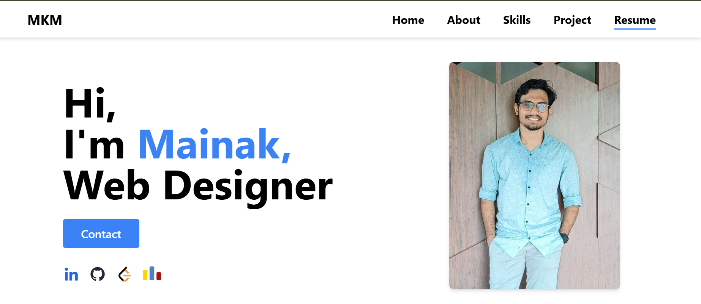
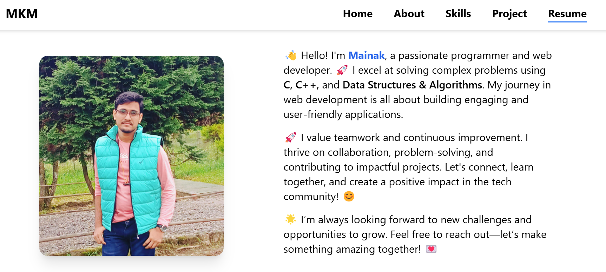
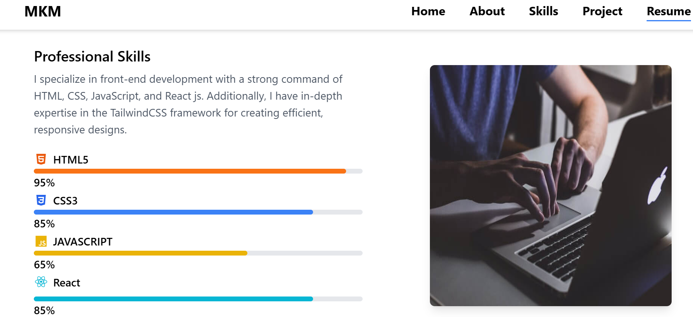
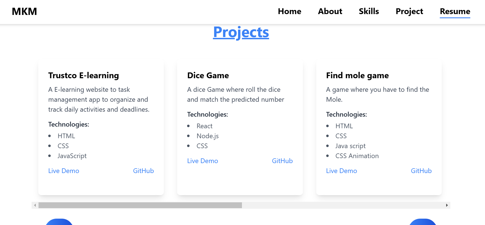
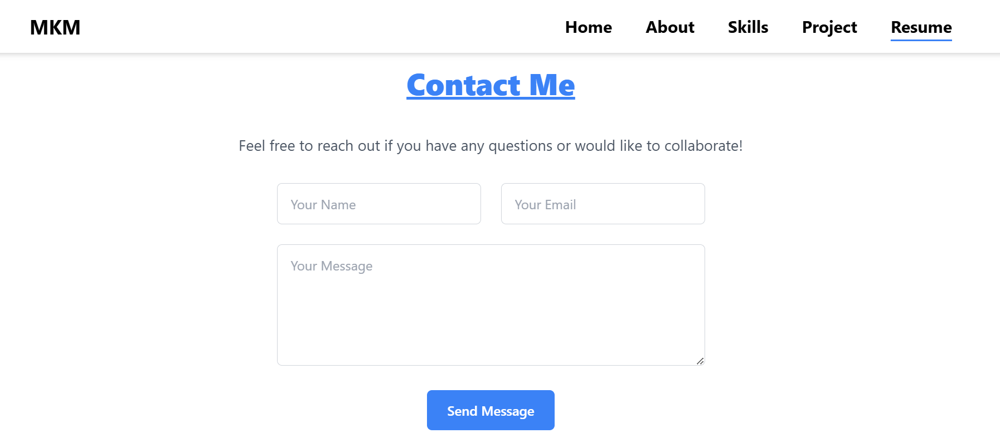

# Portfolio Project

This repository hosts my personal portfolio project, designed to showcase my skills, projects, and experience. It is a fully responsive, modern web application built with the latest technologies.

## Features
- **Responsive Design:** Optimized for desktop, tablet, and mobile devices.
- **Dynamic Content:** Includes interactive elements and animations.
- **Project Showcase:** Highlights key projects with detailed descriptions and live links.
- **Contact Form:** Easy way for visitors to get in touch.
- **Blog Section (optional):** Share insights, tutorials, or updates.

## Tech Stack
- **Frontend:** HTML, CSS, JavaScript, React.js
- **Backend:** Node.js (optional if dynamic content is used)
- **Styling:** Tailwind CSS / Sass
- **Hosting:** GitHub Pages / Vercel / Netlify

## Installation

1. Clone the repository:
   ```bash
   git clone https://github.com/MkM630/Portfolio-25.git
   ```
2. Navigate to the project directory:
   ```bash
   cd Portfolio-25
   ```
3. Install dependencies:
   ```bash
   npm install
   ```
4. Start the development server:
   ```bash
   npm run dev
   ```
5. Open your browser and visit `http://localhost:3000` to view the project.

## Deployment

1. Build the project:
   ```bash
   npm run build
   ```
2. Deploy to GitHub Pages / Vercel / Netlify by following their specific guidelines.

## Contributions
Feel free to fork this repository and submit pull requests. Suggestions and improvements are always welcome.

## Screenshots

<h3>Home page</h3>

<h3>About</h3>

<h3>Skill</h3>

<h3>Project</h3>

<h3>Footer</h3>


## License
This project is licensed under the MIT License. See the LICENSE file for details.

---

### Contact
For any inquiries, please email me at [mainakmaitra22@gmail.com]. You can also find me on [LinkedIn](https://www.linkedin.com/in/mainakmaitra/) or check out my other projects on [GitHub](https://github.com/MkM630).

Thank you for visiting my portfolio!
